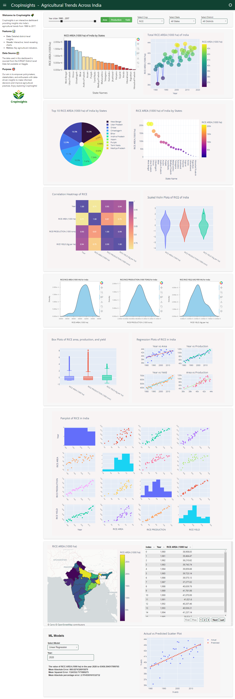

# CropInsights
A dashboard made using python's panel library and utilized Icrisat District Level data for visualizations. This dashboard comprises of various plot that covers the exercise topics for our data visualization lab. If you want to take a look at the exercise notebooks you can check out my kaggle [profile](https://www.kaggle.com/rameezakther). The sample output of the dashboard is below  
**Note** : There are lot of repetitions in the code that need to be handled and error may throw up in between and also the app takes a lot of time for updating the page upon any changes in the data frame.
